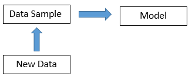

# Introduction and Motivation 
## Introduction 

* Your profiles ? A little survey to start
* My profile: 
    - Maths & Engineer background 
    - 4 years in Economic & Finance Studies 
    - 3 years as Data Scientist 
    - Still not a specialist Data Scientist, good enough to get more specialised

## Context and Motivation 

* **The context**: The digital revolution has been changing the landscape of our society
    - Information versus Data
    - Digitalisation Process: Smartphones, Social Networks & IoTs
    - **Humans** and **Machines** together
    - New jobs and old jobs evolving: Business Analyst, BI, Data Engineers, Data Architect, Data Scientist, Data Analyst etc
    - Transition from model-centric to data-centric 
* **The motivation**:
    - A data-centric discussion about data assets, applications and the business 
    - A look in the past, the present to look further into the future 
    
# The data portfolio structure
## data-centric is dominating model-centric

* Models are more useful for humans than data. We teach models, theories and not data. 
* When new data are like old data, use current models instead. When not, develop new models. 
* Data-centric dominates model-centric each time there is an explosion of new data: 
    - Telescope invention with Copernicus, Galileo, Kepler and Newton

## The data assets

* Data as in IT which is almost everything:  
    - Big data with the 4Vs: volume, variety, veracity and velocity
    - Structured vs Non-structured or SQL vs No-SQL database or CSV vs JSON 
    - Good quality and bad quality 
    - Machine friendly vs human friendly
    - Raw data vs distilled data (most of the time aggregated data)
    - Internal vs external or private vs open data 
    - Storage, Extraction, Search, Data Mining, Data Science
* Of course, there are still a lot of information which has not appeared as IT data form, so out of IT reach 

## The model and application assets

* Different kinds of models: 
    - Learning models: non-supervised, supervised, reinforcement learning 
    - Expert models
    - Mixing learning and expert models 
    - Mathematical formula versus trained models (~ applications)
    - Human friendly models versus black-box models 
    - Stability of models
    - Different models developed for each type of data. No free-lunch theorem. 
* An application is various relevant models in production to serve some **business goals** (KPI)
* Old model versus modern model 
* Big challenge for the business to manage the data, models (applications) assets. 

## The data-centric making of an application

* Actors: data engineers, data admin, data scientists & business leader 
* Steps: 
    1. Defining the business goals and the data scope 
    2. Gathering data & preparing data 
    3. Designing & training of different learning models 
    4. Packing good models into one great solution 
    5. Implementation of the solution in production
    6. Business validation
    7. Monitoring data & models in production, creatin the re-training process 
    8. Deploying the application 

## The digitalisation process 

* More tangible 
* More intergrated 
* More interactive 
* More complex

## The different corresponding jobs 

* Data engineer 
* Data admin
* Data architect
* Data scientist
* Data analyst 
* Business Analyst 
* Project manager
* etc 

# Conclusion 
## What we are heading to then ? 

* Humans and machines collaboration to serve the human society

